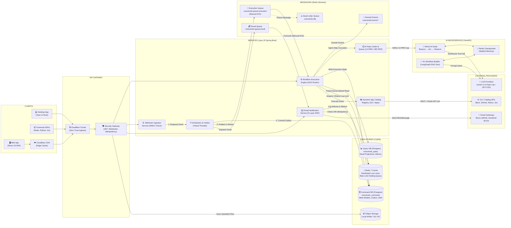

# Crescendo Platform: Complete System Architecture & Engineering Blueprint

This document provides a comprehensive, component-by-component architectural specification of the **Crescendo** workflow automation platform, illustrating all subsystems, data structures, event pipelines, queues, workers, and failover topologies using structural boxes and arrows complying with Crescendo's actual implementation.

---

## 1. Master System Design Diagram (Boxes & Arrows Layout)



---

## 2. Structural ASCII System Map (Detailed Wire Layout)

```
+-----------------------------------------------------------------------------------------------------------------------------------------+
|                                                      CLIENTS & INGRESS TIER                                                             |
|  [ Web Browser SPA ]      [ Tauri Native Desktop ]      [ SDK Ecosystem ]      [ Webhook Emitters ]                                     |
|   (React 19 / Vite)        (Rust / RFC 8252 Handoff)     (Node/Python/Go)       (GitHub, Stripe, etc.)                                  |
|           |                           |                         |                        |                                              |
|           +---------------------------+-------------------------+------------------------+                                              |
|                                       | (HTTPS / TLS)                                                                                   |
|                                       v                                                                                                 |
|                        [ Cloudflare Edge CDN & Tunnel ] <---- Zero Public Host Ports Exposed                                            |
+---------------------------------------+-------------------------------------------------------------------------------------------------+
                                        | (Internal Docker Bridge Network)
                                        v
+-----------------------------------------------------------------------------------------------------------------------------------------+
|                                               CORE SERVICES (Java 25 Spring Boot)                                                       |
|                                                                                                                                         |
|  +---------------------------+   +---------------------------+   +---------------------------+   +-------------------------------+  |
|  |    Ingress Controllers    |   | Workflow Execution Engine |   | Transactional Email Engine|   |   AI Rate Limiter & Queue     |  |
|  |  - Auth & WebAuthn / Pass |   |  - DAG Edge-State Router  |   |  - 5-Layer ESP Pipeline   |   |  - 14 RPM / 480 RPD Gate      |  |
|  |  - Public API (/api/v1/*) |   |  - Catalog Registry (111+)|   |  - Daily Warming Engine   |   |  - 30s Redis Holding Queue    |  |
|  |  - Webhook Ingest (HMAC)  |   |  - Native REST Fallback   |   |  - RFC 8058 Unsubscribe   |   |  - 3s Downstream 429 Backoff  |  |
|  +-------------+-------------+   +-------------+-------------+   +-------------+-------------+   +---------------+---------------+  |
|                |                               |                               |                                 |                      |
|                | Write Intent & Events         | Dequeue Step & Lock           | Send Tasks                      | Evaluate Quota       |
|                v                               v                               v                                 v                      |
|  +-----------------------------------------------------------------------------------------------------------------------------------+  |
|  | Schedulers & Daemons (Virtual Threads): OutboxPublisher (500ms) | PollingTriggerScheduler | PEL Reaper (>60s) | WarmupScheduler   |  |
|  +---------------------------------------------+-----------------------------------------------------------------+-------------------+  |
+------------------------------------------------|-----------------------------------------------------------------|----------------------+
                                                 |                                                                 |
                   Publish Outbox Events         | Consume Execution Steps (Manual ACK)                            | ReAct Invocation
                   v                             v                                                                 v
+------------------------------------------------+--------------+  +-----------------------------------------------+----------------------+
|             MESSAGING (Redis 7 Streams)                       |  |        AI / ML MICROSERVICE (crescendo-aiml)                         |
|                                                               |  |                                                                      |
|  [ crescendo:queue:execution ] <--- Workflow Steps to Execute |  |  +----------------------------+   +-------------------------------+  |
|  [ crescendo:queue:email ]     <--- Email Send Jobs           |  |  | Autonomous ReAct AI Agent  |   | Natural Language DAG Builder  |  |
|  [ crescendo:events:* ]        <--- Domain Events Fanout      |  |  |  - Tool Calling Loop       |   |  - Intent Classification      |  |
|  [ crescendo:dlq ]             <--- Poisoned Retried Messages |  |  |  - XML Boundary Protection |   |  - Catalog Constraint Check   |  |
|                                                               |  |  +--------------+-------------+   +---------------+---------------+  |
|  Consumer Group: crescendo-backend (Manual ACK Required)      |  |                 |                                 |                  |
+--------------------------------+------------------------------+  |                 +----------------+----------------+                  |
                                 |                                 |                                  v                                   |
                                 |                                 |               [ Redis Conversational Checkpointer ]                  |
                                 |                                 |                  (Multi-turn Memory via Redis)                       |
                                 |                                 +----------------------------------+-----------------------------------+
                                 |                                                                    |
                                 |                                                                    v
                                 |                                                  [ LLM APIs: Gemini 3.5 / GPT-OSS ]
                                 v
+-----------------------------------------------------------------------------------------------------------------------------------------+
|                                                 CQRS DATA STORES & PERSISTENCE                                                          |
|                                                                                                                                         |
|  [ Command DB (PostgreSQL 16) ]      [ Query DB (PostgreSQL 16) ]        [ Redis 7 Cache & Locks ]       [ File Storage ]               |
|   - Write side, strict foreign keys   - Denormalized read models          - Atomic Lua Distributed Locks  - Local NVMe / S3 / R2        |
|   - Transactional Outbox table        - Fast index-only scans for UI      - Token Ownership UUIDs         - Uploaded File Command       |
|   - Per-User Encryption Keys (DEK)    - Zero lock contention with writes  - Rate Limit Key Buckets        - Presigned download URLs     |
|   - 16 MB WAL Segments, 8 Conns       - 8 Hikari Connection Pool          - In-memory AOF persistence     - FileStorageService          |
+-----------------------------------------------------------------------------------------------------------------------------------------+
```

```
===================================================================================================================
                                                  CLIENT TIER
===================================================================================================================
  [ React 19 Web SPA ]      [ Tauri v2 Native Desktop ]        [ Universal SDKs ]       [ Webhook Emitters ]
   app.crescendo.run          Rust / Deep Links RFC 8252       Node, Python, Go, etc.    GitHub, Stripe, Slack
           │                            │                               │                         │
           └────────────────────────────┼───────────────────────────────┴─────────────────────────┘
                                        │ HTTPS / TLS (Ports 443/80)
                                        ▼
===================================================================================================================
                                        INGRESS & PERIMETER SECURITY
===================================================================================================================
                        [ Cloudflare Edge Network / CDN ]
                          - DDoS Protection & SSL Offloading
                          - Edge Caching (Static Vite Bundles)
                                        │
                                        ▼ (Zero Public Ports Exposed)
                        [ Cloudflare Tunnel (cloudflared) ]
                          - Outbound-only tunnel connection
                          - Direct proxy to internal bridge network
                                        │
                                        ▼
===================================================================================================================
                          INTERNAL DOCKER NETWORK (crescendo-network: Bridge)
===================================================================================================================
  ┌─────────────────────────────────────┬────────────────────────────────────────────────────────────────────────┐
  │ FRONTEND STATIC CONTAINER           │ CORE BACKEND ENGINE (Java 25 Spring Boot 4)                            │
  │ [ crescendo-frontend: Nginx ]       │ [ crescendo-backend: Internal Port 8080 ]                              │
  │ Serves compiled React 19 SPA        │                                                                        │
  └─────────────────────────────────────┘ ┌────────────────────────────────────────────────────────────────────┐ │
                                          │ 1. INGRESS CONTROLLER GATEWAYS                                     │ │
                                          │  - AuthenticationController (JWT, Passkeys/WebAuthn)               │ │
                                          │  - DesktopHandoffController (RFC 8252 60s single-use tokens)       │ │
                                          │  - PublicApiController (/api/v1/*, IdempotencyFilter, Keyset Page) │ │
                                          │  - WebhookIngestController (HMAC Verification, Rate Limiting)      │ │
                                          └─────────────────────────────────┬──────────────────────────────────┘ │
                                                                            │                                    │
                                          ┌─────────────────────────────────▼──────────────────────────────────┐ │
                                          │ 2. WRITE SIDE PERSISTENCE & OUTBOX                                 │ │
                                          │  - User_commandService, Workflow_commandService                    │ │
                                          │  - Transactional Outbox (logbook_outbox table)                     │ │
                                          │  - Cryptographic Erasure (CryptoShreddingService, per-user DEK)    │ │
                                          │  - Envelope Crypto (AES-256-GCM Credential Encryption)             │ │
                                          └─────────────────────────────────┬──────────────────────────────────┘ │
                                                                            │                                    │
                                          ┌─────────────────────────────────▼──────────────────────────────────┐ │
                                          │ 3. SCHEDULED DAEMONS & REAPERS (Virtual Threads)                   │ │
                                          │  - OutboxPublisher Loop (Polls outbox every 500ms -> Redis Stream) │ │
                                          │  - PollingTriggerScheduler (Dynamic HTTP trigger polling)          │ │
                                          │  - PendingEntryList (PEL) Reaper (Reclaims stalled messages >60s)  │ │
                                          │  - EmailDomainWarmupScheduler (Evaluates rolling 48h bounce gates) │ │
                                          └─────────────────────────────────┬──────────────────────────────────┘ │
                                                                            │                                    │
                                          ┌─────────────────────────────────▼──────────────────────────────────┐ │
                                          │ 4. EXECUTION ENGINE & REGISTRY                                     │ │
                                          │  - WorkflowExecutionEngine (DAG Edge-State Router)                 │ │
                                          │  - Dynamic App Catalog Registry (111+ App Handlers)                │ │
                                          │  - Distributed Lock Manager (Redis Lua Atomic Token Locks)         │ │
                                          │  - Native Java REST Fallback Client (Direct Gemini/OpenAI caller)  │ │
                                          └────────────────────────────────────────────────────────────────────┘ │
                                                                            ▲
                                                                            │
      ┌─────────────────────────────────────────────────────────────────────┴────────────────────────────────┐
      ▼                                                                                                      ▼
===================================================                                ===================================================
        MESSAGING & STREAM QUEUES (Redis 7)                                                 AI / ML MICROSERVICE (FastAPI)
===================================================                                ===================================================
  [ Redis Streams (AOF Enabled) ]                                                    [ crescendo-aiml: Python 3.12 + LangGraph ]
  │                                                                                  │
  ├──► crescendo:queue:execution                                                     ├──► Autonomous ReAct Agent (/v1/agent/next-step)
  │      - Step execution queue                                                      │      - Multi-turn Reason → Act → Observe loop
  │      - Consumer Group: crescendo-backend                                         │      - 111+ App Catalog Tool Synthesizer
  │      - Manual ACK on completion                                                  │      - XML Boundary Defense (<tool_output_content>)
  │                                                                                  │
  ├──► crescendo:queue:email                                                         ├──► Natural Language DAG Workflow Generator
  │      - Transactional email send tasks                                            │      - Intent classification & ambiguity gates
  │                                                                                  │      - Conditional DAG synthesis
  │  ├──► crescendo:events:workflow / user / auth                                    │
  │      - Domain event fanout stream                                                └──► Redis Conversational Checkpointer
  │                                                                                         - Multi-turn stateful conversational memory
  └──► crescendo:dlq (Dead Letter Queue)                                                                     │
         - Max retries exceeded poisoned events                                                              ▼
                                                                                   [ External LLM APIs: Gemini, Groq, OpenAI ]
                                      │
                                      ▼
===================================================================================================================
                                      PERSISTENCE & CQRS STORAGE TIER
===================================================================================================================
  ┌────────────────────────────────────────────────────────┐ ┌──────────────────────────────────────────────────┐
  │ COMMAND DATABASE: crescendo_command (PostgreSQL 16)    │ │ QUERY DATABASE: crescendo_query (PostgreSQL 16)  │
  │  - Write-side relational schema                        │ │  - Denormalized read projections                 │
  │  - Strict foreign keys (fk_workflow_user, etc.)        │ │  - user_query, workflow_query, connections_query │
  │  - Transactional Outbox (logbook_outbox)               │ │  - Fast index-only scans for dashboard UI        │
  │  - Per-user encryption keys (user_encryption_key)      │ │  - Completely isolated from command write locks  │
  │  - Write-Ahead Log (WAL) sequential disk persistence   │ └──────────────────────────────────────────────────┘
  │  - Hikari Pool: 8 connections                          │   - Hikari Pool: 8 connections
  └────────────────────────────────────────────────────────┘
  ┌────────────────────────────────────────────────────────┐ ┌──────────────────────────────────────────────────┐
  │ FILE STORAGE (NVMe Disk / AWS S3 / Cloudflare R2)      │ │ TELEMETRY & METRICS (Prometheus TSDB)            │
  │  - Direct presigned uploads & local storage keys       │ │  - Scrapes Spring Boot /actuator/prometheus      │
  │  - Managed by FileStorageService                       │ │  - 15-day time-series retention                  │
  └────────────────────────────────────────────────────────┘ └──────────────────────────────────────────────────┘
===================================================================================================================
```

---

## 2. Core Execution Lifecycles (Step-by-Step Flow)

### A. The Life of a Polling Trigger
```
[ PollingTriggerScheduler ]
        │  (Triggers at scheduled cron / interval, e.g. every 5 min)
        ▼
[ Fetch Credentials & Decrypt ] ──► ConnectionCredentialsCryptoService (AES-256-GCM)
        │
        ▼
[ Outbound HTTP Call to Third Party ] (e.g. GitHub: GET /repos/{owner}/{repo}/issues)
        │
        ├── No new items found ──► (Sleep until next poll interval)
        │
        └── New items found!
                 │
                 ▼
[ Transaction Boundary: Command DB ]
   ├── Insert Workflow Run record (status: RUNNING)
   └── Insert event to `logbook_outbox` table
                 │
                 ▼ (Commit)
[ OutboxPublisher Loop (500ms) ]
   └── Reads outbox ──► Appends to `crescendo:queue:execution` Redis Stream
```

---

### B. The Life of a Stream Execution Step
```
[ Redis Stream: crescendo:queue:execution ]
        │
        ▼ (XREADGROUP - Consumer Group: crescendo-backend)
[ StreamExecutionConsumer (Virtual Thread) ]
        │
        ├── 1. Acquire Distributed Lock (Redis Key: workflow-execution:{id})
        │      └── Atomic Lua script with UUID token + Background Heartbeat Renewal
        │
        ├── 2. Resolve Step Handler via Dynamic App Catalog Registry
        │      └── e.g., SlackSendMessageHandler, GoogleDriveUploadHandler, AgentNode
        │
        ├── 3. Execute Step Action
        │      ├── Success: Store Step Run Output JSON
        │      └── Failure: Increment retry count (if retries exhausted ──► send to crescendo:dlq)
        │
        ├── 4. Evaluate Downstream Edge Conditions (DAG Router)
        │      └── If condition matches: Push next steps to `logbook_outbox`
        │
        ├── 5. Write Execution State to `crescendo_command` & Project to `crescendo_query`
        │
        ├── 6. Release Distributed Lock (Atomic Lua script with ownership token verification)
        │
        └── 7. Send XACK to Redis Stream (Acknowledge message processing complete)
```

---

### C. The Life of an Autonomous AI Agent Step (`agent:ai_agent`)
```
[ WorkflowExecutionEngine ]
        │
        ▼
[ Agent Step Encountered ]
        │
        ▼
[ Dynamic Tool Synthesis ]
   ├── Reads catalog configSchemas for enabled apps (e.g., Jira, Slack, Notion)
   └── Converts schemas to OpenAI / Gemini function_declarations JSON
        │
        ▼
[ Route to crescendo-aiml (Python FastAPI) ] ──(If unavailable)──► [ Native Java REST Fallback ]
        │                                                                 │
        ▼                                                                 ▼
[ Multi-turn ReAct Loop ]                                         [ Direct Gemini / Groq API ]
   │
   ├── Turn 1: LLM analyzes input + prompt ──► Decides to call tool: `slack__send_message`
   │
   ├── Tool Execution: Dispatches internally to `SlackActionHandler` with decrypted user tokens
   │
   ├── XML Boundary Protection: Wraps output in `<tool_output_content>{...}</tool_output_content>`
   │
   └── Turn 2: LLM evaluates observation ──► Emits final synthesized answer JSON
        │
        ▼
[ Write Agent Run History & ReAct Timeline ] ──► Available for inspection in UI drawer
```

---

### D. The Life of Account Deletion & Cryptographic Erasure
```
[ User issues DELETE /users/me ]
        │
        ▼
[ User_commandService.deleteAccount(userId) ] (Strict Cascading Order)
        │
        ├─► 1. Workflow_commandService.purgeAllWorkflowsForUser(userId)
        │      ├── Deactivate workflows
        │      ├── Publish WorkflowDeletedEvent ──► PollingTriggerScheduler halts polling immediately
        │      └── Hard delete steps, edges, query projections, and command workflows
        │
        ├─► 2. Connections_commandService.purgeAllConnectionsForUser(userId)
        │      └── Delete command credentials & query projections
        │
        ├─► 3. Storage Cleanup
        │      ├── Iterate user's uploaded files ──► FileStorageService.delete() from S3/disk
        │      └── Delete uploaded_file_command rows
        │
        ├─► 4. Email Resources Cleanup
        │      └── Delete contacts, broadcasts, email templates, API keys, and custom domains
        │
        ├─► 5. WebAuthn Passkeys Cleanup
        │      └── Delete passkey credentials
        │
        ├─► 6. Cryptographic Shredding (CryptoShreddingService)
        │      └── DELETE FROM user_encryption_key WHERE user_id = userId
        │          (Destroys user's 256-bit AES DEK; historic backups & WAL logs become unrecoverable)
        │
        ├─► 7. Auth & Session Cleanup
        │      ├── Delete MFA backup codes and settings
        │      ├── Revoke and purge all user sessions
        │      └── Delete credentials and identity records
        │
        └─► 8. Hard delete user row from user_command
               └── Publish UserAccountDeletedEvent
```

---

## 3. Subsystem Breakdown & Design Patterns

### 1. CQRS (Command Query Responsibility Segregation)
| Database | Role | Data Models | Properties |
| :--- | :--- | :--- | :--- |
| **`crescendo_command`** | Write-side | `user_command`, `workflow_command`, `connections_command`, `logbook_outbox`, `user_encryption_key` | Enforces foreign keys, atomic transactions, ACID consistency, strict business invariants. |
| **`crescendo_query`** | Read-side | `user_query`, `workflow_query`, `connections_query`, `email_metrics` | Denormalized projections, index-only scans, zero write locks, serves fast UI queries. |

### 2. Transactional Outbox Pattern
- **Problem Avoided**: Dual-write hazard (saving to Postgres and publishing to Redis separately can leave state inconsistent if Redis fails or DB rolls back).
- **Solution**: Events are written to the `logbook_outbox` table in the *same* database transaction as the business entity. A lightweight `OutboxPublisher` polls every 500ms, pushes to Redis Streams, and marks outbox rows processed.

### 3. Redis Streams with Consumer Groups & PEL Reaper
- **Consumer Group**: `crescendo-backend` distributes step execution across worker threads.
- **Manual ACK**: Messages are only acknowledged (`XACK`) once the step output is committed to the database.
- **PEL Reaper (Pending Entry List)**: Detects messages that were delivered to a worker that crashed or timed out ($>60\text{s}$), reclaims ownership, and re-executes them.
- **Dead Letter Queue (DLQ)**: Poison messages exceeding retry thresholds are pushed to `crescendo:dlq` to prevent queue head-of-line blocking.

### 4. Distributed Lock with Token Ownership
- **Lock Key**: `crescendo:lock:workflow-execution:{subWorkflowId}`
- **Atomic Lua Unlock**: Verifies that the lock token matches the executing thread’s UUID before deleting the key, preventing a thread from releasing another thread's lock after an expiration.
- **Heartbeat Daemon**: Automatically extends lock TTL every 10 seconds for long-running steps.

### 5. Native Desktop Handoff Authentication (RFC 8252)
- **Tauri v2 (Rust)**: Bypasses embedded webviews; opens the user's system browser for secure biometric authentication (WebAuthn Passkeys).
- **60s Ephemeral Handoff Code**: Web app issues a short-lived random code, redirects via `crescendo://auth/callback?code=...`.
- **Single-Instance Interception**: `tauri-plugin-single-instance` catches the deep link on the primary window, exchanges the code for dual JWT tokens over HTTPS, leaving zero credentials in browser history or OS logs.

### 6. Transactional Email Platform (5-Layer Architecture)
1. **Identity & Usage-Type Binding**: Strict SPF/DKIM/DMARC verification; separates transactional from marketing domains.
2. **BYOK (Bring Your Own Key)**: Users can use SendGrid/SES credentials or fallback to platform Brevo routing.
3. **Automated Warming Engine**: Exponential doubling schedule (50 $\to$ 100 $\to$ 200 ... up to 50k/day) gated by a rolling 48-hour bounce rate ($<5\%$) and complaint rate ($<0.1\%$).
4. **RFC 8058 Compliance**: Automatically injects one-click `List-Unsubscribe` headers to prevent spam flags.
5. **Suppression Portability**: Handles bounces, spam complaints, and CSV/JSON bulk suppression lists.

---

## 4. Hardware & Resource Budget (Single 4 GiB VPS)

```
┌────────────────────────────────────────────────────────┐
│               Host Physical RAM: 4,096 MiB             │
├───────────────────────────────┬────────────────────────┤
│ Subsystem / Container         │ Allocated RAM          │
├───────────────────────────────┼────────────────────────┤
│ JVM Backend (Java 25)         │ 1,018 MiB (~25%)       │
│ PostgreSQL 16 (Command+Query) │ 440 MiB (~11%)         │
│ Redis 7 (In-Memory Streams)   │ 256 MiB (~6%)          │
│ Python AI/ML (LangGraph)      │ 350 MiB (~8%)          │
│ Frontend SPA (Nginx)          │ 25 MiB (<1%)           │
│ Prometheus Telemetry          │ 200 MiB (~5%)          │
│ Cloudflare Tunnel Daemon      │ 35 MiB (<1%)           │
│ Linux OS & File Page Cache    │ 1,772 MiB (~43%)       │
├───────────────────────────────┼────────────────────────┤
│ TOTAL ALLOCATED               │ 4,096 MiB (100%)       │
└───────────────────────────────┴────────────────────────┘
```

> **For complete quantitative Little's Law throughput derivations, token cost equations, webhook burst calculations, and disk growth formulas, refer to [`capacity_calculations.md`](file:///e:/crescendo-backend/capacity_calculations.md).**
