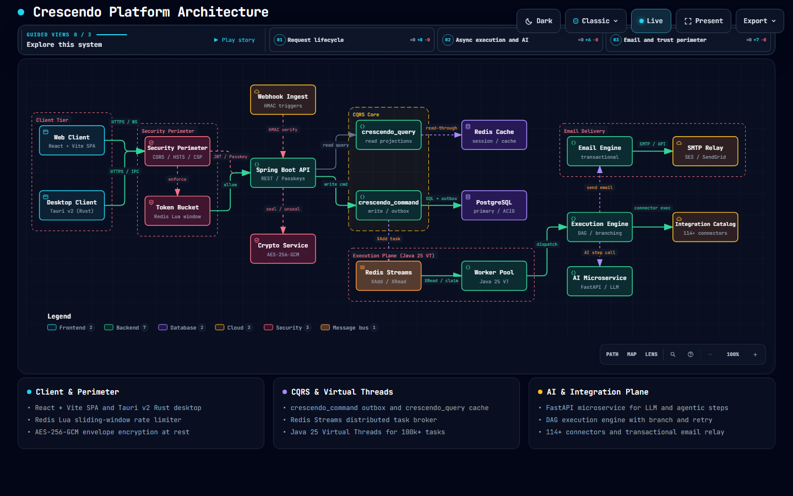
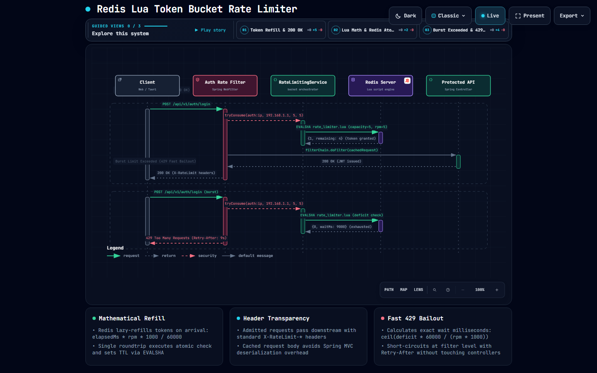
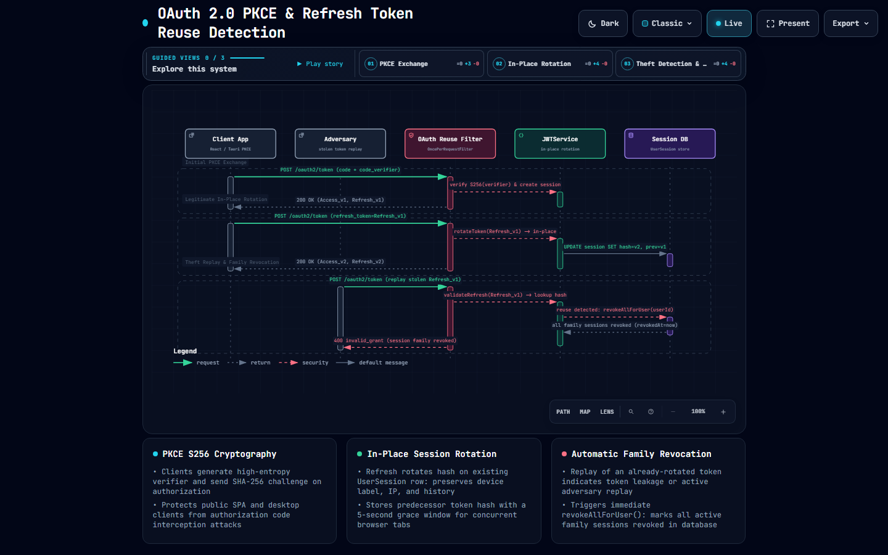
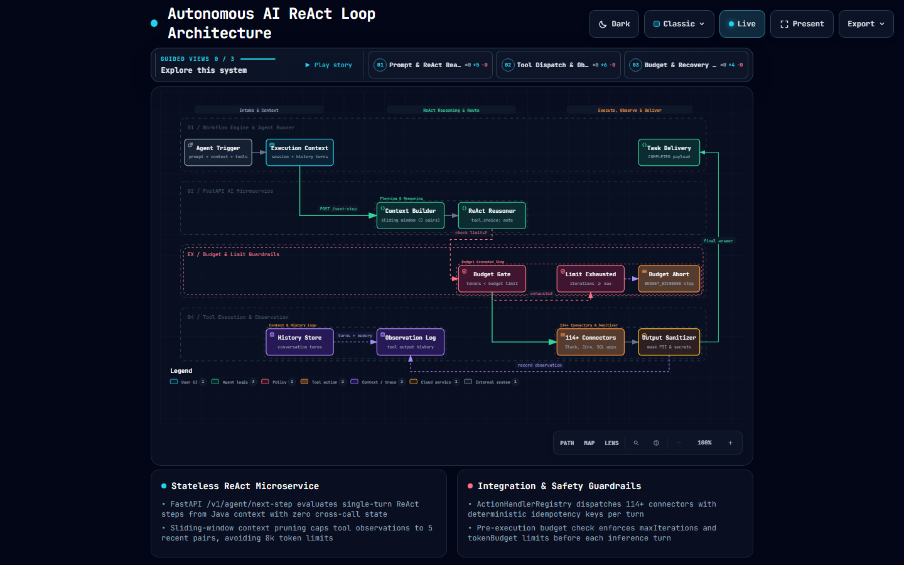
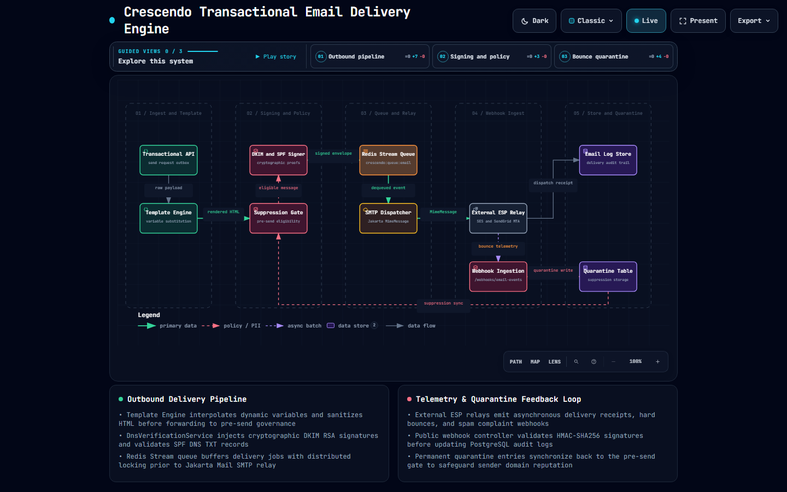
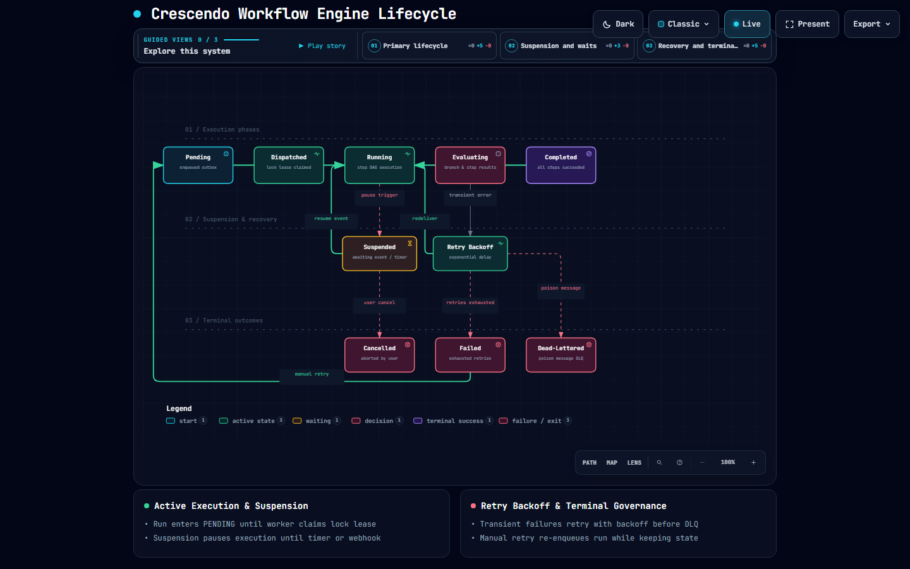

# Crescendo Systems Architecture Suite

A unified architecture specification consolidating all 6 subsystems developed for the Crescendo platform. Each subsystem is verified with precise component boundaries, zero-trust cryptographic protocols, and reactive flow dynamics.

Visual architecture diagrams are preserved under [`assets/dark/`](assets/dark/) and [`assets/light/`](assets/light/), and declarative models are maintained under [`specs/`](specs/).

---

## 1. Crescendo Multi-Tenant Distributed Platform Architecture

- **Diagram Mode**: `Architecture` (System Topology & Boundary Map)
- **Visual Diagram**: [Dark Mode](assets/dark/platform.png) · [Light Mode](assets/light/platform.png)
- **JSON Specification**: [specs/platform.architecture.json](specs/platform.architecture.json)
- **Primary Source Implementations**:
  - Edge Security: [`RateLimitingService.java`](../crescendo-backend/src/main/java/com/crescendo/security/RateLimitingService.java)
  - CQRS Write Side: [`Workflow_commandService.java`](../crescendo-backend/src/main/java/com/crescendo/workflow/workflow_command/Workflow_commandService.java)
  - CQRS Read Side: [`Workflow_queryService.java`](../crescendo-backend/src/main/java/com/crescendo/workflow/workflow_query/Workflow_queryService.java)
  - Core Execution Engine: [`WorkflowExecutionEngine.java`](../crescendo-backend/src/main/java/com/crescendo/execution/engine/WorkflowExecutionEngine.java)

### Architectural Overview
The platform topology establishes strict trust and tenant boundaries across five tiers:
1. **Edge & Client Tier**: Browser React applications and Tauri desktop clients terminate TLS at the Spring Cloud Gateway.
2. **Security & Perimeter Tier**: Spring WebFilters enforce JWT cryptographic signature verification, tenant context propagation (`X-Tenant-ID`), and token bucket rate limits before requests reach controllers.
3. **Core Application Tier**: Enforces CQRS segregation—command endpoints execute mutations inside transactional boundaries, while query endpoints serve read models cached in Redis.
4. **Data & Storage Tier**: Polyglot persistence optimizes for distinct data shapes:
   - **PostgreSQL 16**: Relational entities, CQRS command & query schemas, row-level tenant security, and transactional outbox.
   - **Redis 7 Cluster**: Distributed lock leases, atomic token buckets, and event stream queues.
   - **Object Storage**: Local NVMe / Amazon S3 / Cloudflare R2 for presigned file uploads.
5. **Event Streaming & AI Tier**: Redis 7 Streams (`crescendo:queue:execution`, `crescendo:queue:email`) guarantee consumer group manual ACK delivery, dispatching asynchronous ReAct tasks to the FastAPI Autonomous AI microservice.

---

## 2. Redis Lua Atomic Token Bucket Rate Limiter

- **Diagram Mode**: `Sequence` (Interactive Request Flow)
- **Visual Diagram**: [Dark Mode](assets/dark/rate-limiter.png) · [Light Mode](assets/light/rate-limiter.png)
- **JSON Specification**: [specs/rate-limiter.sequence.json](specs/rate-limiter.sequence.json)
- **Primary Source Implementations**:
  - Token Bucket Logic: [`RateLimitingService.java`](../crescendo-backend/src/main/java/com/crescendo/security/RateLimitingService.java)
  - Perimeter Filter: [`RateLimitFilter.java`](../crescendo-backend/src/main/java/com/crescendo/security/RateLimitFilter.java)
  - Tier Configuration: [`RateLimitConfig.java`](../crescendo-backend/src/main/java/com/crescendo/config/RateLimitConfig.java)

### Architectural Overview
Guards the API perimeter from denial-of-service bursts and tenant quota starvation:
1. **Atomic Script Execution**: Preloads a Lua script (`EVALSHA`) into Redis, executing the read-calculate-refill-deduct cycle in a single atomic server tick without distributed lock contention.
2. **Clock Skew Mitigation**: Calculates elapsed time using the Redis server `TIME` primitive rather than application node clocks, preventing multi-instance drift.
3. **Integer Millitoken Arithmetic**: Multiplies tokens by 1,000 to eliminate IEEE 754 floating-point precision truncation during continuous fractional token refill.
4. **Perimeter Short-Circuit**: If tokens are exhausted, the filter immediately returns HTTP `429 Too Many Requests` with a computed `Retry-After` header, terminating the request before downstream controllers wake up.
5. **Standard Compliance**: Injects RFC-compliant headers (`X-RateLimit-Limit`, `X-RateLimit-Remaining`, and `X-RateLimit-Reset`) on all admitted HTTP 200 responses.

---

## 3. OAuth 2.0 PKCE & Refresh Token Family Reuse Detection

- **Diagram Mode**: `Sequence` (Legitimate vs Replay Flow)
- **Visual Diagram**: [Dark Mode](assets/dark/oauth-pkce-reuse.png) · [Light Mode](assets/light/oauth-pkce-reuse.png)
- **JSON Specification**: [specs/oauth-pkce-reuse.sequence.json](specs/oauth-pkce-reuse.sequence.json)
- **Primary Source Implementations**:
  - Session Controller: [`SessionController.java`](../crescendo-backend/src/main/java/com/crescendo/security/SessionController.java)
  - Cryptographic Signing: [`JwtService.java`](../crescendo-backend/src/main/java/com/crescendo/security/JwtService.java)
  - Cookie Management: [`RefreshTokenCookieService.java`](../crescendo-backend/src/main/java/com/crescendo/security/RefreshTokenCookieService.java)

### Architectural Overview
Implements RFC 7636 (PKCE) and zero-trust session token rotation with breach containment:
1. **SHA-256 Code Challenge**: During authorization code redemption, the backend verifies that `SHA256(code_verifier) == code_challenge`, defending public SPA and mobile clients against authorization code interception.
2. **Dual-Token Exchange**: Generates a short-lived stateless JWT access token (15-minute expiry) and a stateful refresh token stored in an `HttpOnly`, `Secure`, `SameSite=Strict` cookie.
3. **Single-Use Rotation**: Every refresh token exchange invalidates the incoming token and issues a new successor token linked to the session family tree.
4. **Family Reuse Detection**: If an adversary presents a previously exchanged refresh token, the engine identifies the token family breach, flags the replay attack, and cascades immediate revocation across all tokens in that family—terminating active sessions on both legitimate and compromised clients.

---

## 4. Autonomous AI ReAct Agent Loop & Microservice Orchestration

- **Diagram Mode**: `Workflow` (Schema v2 Iterative Loop)
- **Visual Diagram**: [Dark Mode](assets/dark/react-agent.png) · [Light Mode](assets/light/react-agent.png)
- **JSON Specification**: [specs/react-agent.workflow.json](specs/react-agent.workflow.json)
- **Primary Source Implementations**:
  - Python AI Agent: [`agent_service.py`](../crescendo-aiml/app/services/agent_service.py)
  - Spring AI Bridge: [`AgentExecutionService.java`](../crescendo-backend/src/main/java/com/crescendo/execution/agent/AgentExecutionService.java)
  - Integration Runner: [`SubWorkflowToolRunner.java`](../crescendo-backend/src/main/java/com/crescendo/execution/agent/SubWorkflowToolRunner.java)

### Architectural Overview
Manages reasoning, planning, and external tool execution inside Crescendo's FastAPI microservice:
1. **Prompt Formulation**: Assembles user prompts with conversational context, active connection credentials, and JSON function definitions for all 50+ third-party catalog integrations.
2. **Multi-Model Inference**: Connects transparently to Gemini 1.5/2.0, Anthropic Claude 3.5, or OpenAI GPT-4o, parsing reasoning thoughts and structured tool invocation payloads.
3. **Execution Dispatch**: Resolves user connection credentials via three-tier fallback (Personal $\rightarrow$ Platform Key $\rightarrow$ Admin Default) and calls target APIs.
4. **Observation Feedback**: Formats tool observations, assimilates output data into memory, and iterates until the goal is satisfied.
5. **Loop Safety Governance**: Enforces hard iteration caps (maximum 10 cycles) and timeout budgets to prevent runaway execution loops.

---

## 5. Transactional Email Delivery Engine & Telemetry Feedback Loop

- **Diagram Mode**: `Dataflow` (5-Stage Lifecycle & Feedback Pipeline)
- **Visual Diagram**: [Dark Mode](assets/dark/email-engine.png) · [Light Mode](assets/light/email-engine.png)
- **JSON Specification**: [specs/email-engine.dataflow.json](specs/email-engine.dataflow.json)
- **Primary Source Implementations**:
  - Outbound Service: [`EmailSendService.java`](../crescendo-backend/src/main/java/com/crescendo/service/EmailSendService.java)
  - Queue Consumer: [`EmailQueueConsumer.java`](../crescendo-backend/src/main/java/com/crescendo/service/EmailQueueConsumer.java)
  - Template Interpolator: [`TemplateInterpolator.java`](../crescendo-backend/src/main/java/com/crescendo/service/TemplateInterpolator.java)
  - DNS Verification: [`DnsVerificationService.java`](../crescendo-backend/src/main/java/com/crescendo/service/DnsVerificationService.java)
  - Webhook Ingestion: [`EmailEventWebhookController.java`](../crescendo-backend/src/main/java/com/crescendo/controller/EmailEventWebhookController.java)
  - Suppression Quarantine: [`EmailSuppressionService.java`](../crescendo-backend/src/main/java/com/crescendo/service/EmailSuppressionService.java)

### Architectural Overview
Governs outbound transactional messaging, cryptographic signing, and reputation telemetry:
1. **Template Rendering**: [`TemplateInterpolator`](../crescendo-backend/src/main/java/com/crescendo/service/TemplateInterpolator.java) interpolates dynamic variables and enforces strict HTML sanitization against XSS.
2. **Cryptographic Signing**: [`DnsVerificationService`](../crescendo-backend/src/main/java/com/crescendo/service/DnsVerificationService.java) validates DNS TXT records (`v=DKIM1`, `v=spf1`, `v=DMARC1`) and injects RSA DKIM signature headers.
3. **Queue & Transport**: Buffers messages in Redis Stream `crescendo:queue:email` with distributed locks, injecting RFC 8058 `List-Unsubscribe` one-click headers during Jakarta Mail relay.
4. **Webhook Ingestion**: Public `/webhooks/email-events` endpoint verifies HMAC-SHA256 signatures (`X-Webhook-Signature`), categorizing events into deliveries, hard bounces, soft bounces, and spam complaints.
5. **Suppression Feedback Loop**: Permanent quarantine records feed directly back into the pre-send gate, automatically aborting subsequent dispatch requests to suppressed recipients to protect domain deliverability.

---

## 6. Workflow Execution Engine Lifecycle & State Machine

- **Diagram Mode**: `Lifecycle` (3-Band Execution & State Machine)
- **Visual Diagram**: [Dark Mode](assets/dark/workflow-lifecycle.png) · [Light Mode](assets/light/workflow-lifecycle.png)
- **JSON Specification**: [specs/workflow-lifecycle.lifecycle.json](specs/workflow-lifecycle.lifecycle.json)
- **Primary Source Implementations**:
  - Execution Engine: [`WorkflowExecutionEngine.java`](../crescendo-backend/src/main/java/com/crescendo/execution/engine/WorkflowExecutionEngine.java)
  - Queue Consumer: [`ExecutionQueueConsumer.java`](../crescendo-backend/src/main/java/com/crescendo/shared/infrastructure/stream/ExecutionQueueConsumer.java)
  - Suspension Service: [`WorkflowSuspensionService.java`](../crescendo-backend/src/main/java/com/crescendo/execution/suspension/WorkflowSuspensionService.java)
  - Resume Reaper: [`WorkflowResumeReaper.java`](../crescendo-backend/src/main/java/com/crescendo/execution/queue/WorkflowResumeReaper.java)
  - Crash Reaper: [`WorkflowRunReaper.java`](../crescendo-backend/src/main/java/com/crescendo/execution/queue/WorkflowRunReaper.java)
  - Status Enum: [`WorkflowRunStatus.java`](../crescendo-backend/src/main/java/com/crescendo/enums/WorkflowRunStatus.java)

### Architectural Overview
Models the state transitions and fault tolerance of the DAG workflow engine across three bands:
1. **Primary Lifecycle Phases (`Band 01: main`)**:
   - `Pending` $\rightarrow$ `Dispatched` $\rightarrow$ `Running` $\rightarrow$ `Evaluating` $\rightarrow$ `Completed`.
   - The primary execution rail traces sequential progress as workers claim distributed lock leases and chain step outputs into `executionState`.
2. **Suspension & Recovery (`Band 02: interruptions`)**:
   - `Suspended`: Triggered when an action handler throws [`SuspendExecutionException`](../crescendo-backend/src/main/java/com/crescendo/execution/action/SuspendExecutionException.java) (timer delays, human approvals, or external webhook callbacks). The engine releases worker threads and locks until correlation matching occurs.
   - `Retry Backoff`: Handles transient step errors and database visibility lags with exponential backoff before consumer re-delivery.
3. **Terminal Outcomes (`Band 03: terminal`)**:
   - `Cancelled`: User-initiated abort via REST API.
   - `Failed`: Uncaught step exceptions or reaper timeout sweeps (15-minute hanging execution threshold).
   - `Dead-Lettered`: Absorbs poison messages after 3 exhausted consumer retry attempts.
   - **Manual State-Preserving Retry**: Retrying from `Failed` resets the run to `Pending` while preserving already-succeeded step outputs in `executionState`.
